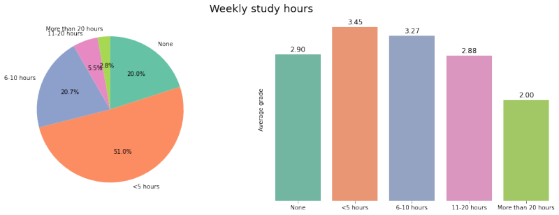
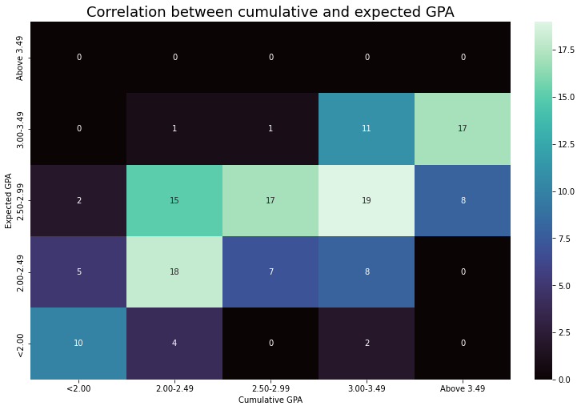

# student-performance-data-visualization


### Data Source 
1. [Student Performance](https://www.kaggle.com/)

### kaggle notebook
1. [Kaggle Notebook](https://www.kaggle.com/code/biswajit01/student-performance-prediction/notebook)

### Software & Tools Requirement

1. [Github Account](https://github.com)
2. [VSCode IDE](https://code.visualstudio.com)
3. [Git CLI](https://git-scm.com/downloads)

Create a new environment

```  
    conda create -p venv python==3.9 -y
```
Activate the environment

``` 
    conda activate ./venv
```
# student-performance-predict

융합 프로젝트에 시작이 되었던 데이터 시각화 모델이다.
kaggle에서 데이터를 찾은 후 2차원 그래프로 시각화를 하였다.




